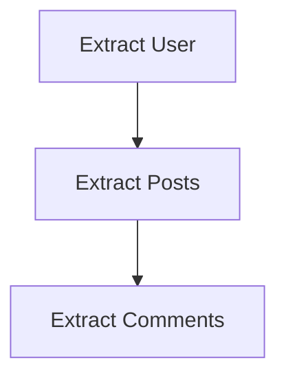

# @wpkernel/pipeline <-> Architecture Guide

## The Philosophy

The pipeline is designed as a **Directed Acyclic Graph (DAG) Execution Engine**. Its primary goal is to take a set of "Helpers"—which can be anything from simple functions to complex services - sort them based on their dependencies, and execute them in a deterministic order.

It is **NOT** opinionated about what your helpers do. It does **NOT** enforce a specific "Fragment/Builder" pattern, though that is a common use case.

## Internal Structure

The codebase is organized into two primary modules to separate concerns:

1.  **Core (`src/core/runner`)**: Contains the pure DAG runner, dependency resolution logic (`src/core/dependency-graph.ts`), and extension orchestration (`src/core/extensions`). It knows nothing about "Fragments" or "Builders" - only generic "Helpers" and "Stages".
2.  **Standard Pipeline (`src/standard-pipeline`)**: Implements the specific "Fragment → Builder" pattern used by WPKernel CLI. It consumes `core` primitives to build the standard execution program (via `createPipeline`).

## Core Concepts

### 1. Helpers & Kinds

A `Helper` is an atomic unit of work identified by a `key`. Every helper belongs to a `kind` (e.g., `'extract'`, `'transform'`, `'render'`).
helpers declare their dependencies using `dependsOn`. The runner builds a separate dependency graph for _each_ kind.

### 2. Stages

A `Stage` defines _when_ a set of helpers executes. You define the sequence of stages in your pipeline.
For example, an ETL pipeline might have three stages corresponding to three helper kinds:

- **Independent execution**: Each stage executes its registered helpers topologically.
- **Shared Context**: Stages share a mutable `context` and can pass data via "Drafts" or "Artifacts".

### 3. Extensions & Lifecycles

Extensions wrap the execution flow. They attach to lifecycle hooks (defined by strings like `'prepare'`, `'commit'`, `'finalize'`).
This allows for cross-cutting concerns:

- **Transactions**: Open a transaction in `prepare`, commit in `commit`, rollback in `rollback`.
- **Logging**: Log start/end times.
- **Resource Management**: Connect/Disconnect databases.

## The "Standard" Model (WPKernel CLI)

While generic, WPKernel's main use case (code generation) uses a specific configuration:

1.  **Phase 1: Fragments (`kind: 'fragment'`)**
    - Helpers generate partial ASTs or code snippets.
    - They write to a shared "Draft" (e.g., a list of PHP blocks).
    - Executed by `makeLifecycleStage` (internal primitive).

2.  **Phase 2: Builders (`kind: 'builder'`)**
    - Helpers take the finalized "Artifact" (merged fragments) and write files to disk.
    - Executed by `makeLifecycleStage` (internal primitive).

3.  **Extensions**
    - Manage file system writes (committing files only if generation succeeds).

## Building Custom Architectures

You can build entirely different architectures using `makePipeline`:

- **Serial Pipelines**: A single stage with one helper kind.
- **Micro-Frontends**: Resolution stages for different UI widgets.
- **Data Migrations**: Versioned migration helpers with rollback guarantees.

The generic runner ensures:

- **Cycle Detection**: `A -> B -> A` halts execution (fails fast).
- **Missing Dependencies**: `A` depends on `C` (which doesn't exist) throws an error.
- **Best-Effort Rollback**: If _any_ stage throws, the pipeline halts and executes the rollback chain for all extensions and helpers.
    > **Note**: Rollbacks attempt to revert completed steps but are not guaranteed to be fully atomic (e.g. if a network call in a rollback fails). They may leave partial effects. Design compensating actions to be idempotent.
