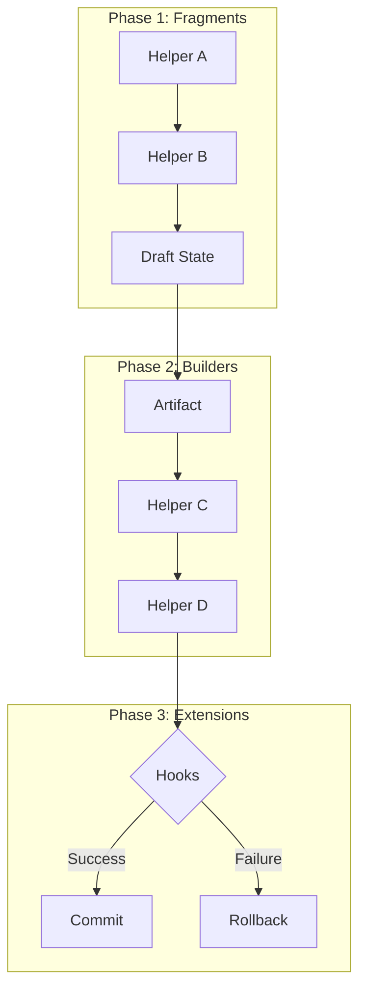

# @wpkernel/pipeline Architecture Guide

## Overview

`@wpkernel/pipeline` orchestrates helper DAGs, extension hooks, and transactional commits for any generation task. Pipelines collect fragments, build artefacts, and coordinate rollbacks so CLI builders, UI registries, and PHP codemods all share the same execution guarantees.

## Workflow

A pipeline assembles fragments, executes builders, and then commits or rolls back work depending on reporter diagnostics. Helpers register dependencies so the scheduler can resolve order, while extensions observe or mutate artefacts during the hook phase before commits fire.



## Examples

```ts
const resourcePipeline = makePipeline({
	createContext: (reporter) => ({
		reporter,
		config: loadKernelConfig(),
	}),
	buildFragment: (ctx, opts) => {
		return buildResourceClass(opts.input, ctx.config);
	},
	buildArtifact: async (ctx, opts) => {
		const code = await printPhpAst(opts.draft);
		return { artifact: code };
	},
});

resourcePipeline.use(phpOpeningTagHelper);
resourcePipeline.use(namespaceHelper);
resourcePipeline.use(useStatementsHelper);
resourcePipeline.use(classDefinitionHelper);
resourcePipeline.use(writeFileHelper);
resourcePipeline.use(formatCodeHelper);
```

## Patterns

Model fragments as pure functions that return serialisable drafts and let builders persist artefacts. Declare helper dependencies explicitly so the DAG resolver can detect cycles and surface conflict diagnostics when helpers target the same output.

## Extension Points

Use `createPipelineExtension()` to wrap transactional work in hooks. Extensions can enqueue commit and rollback callbacks, mutate artefacts, or inject diagnostics, and they run after helpers finalise drafts but before commits execute, ensuring rollback metadata stays consistent.

## Testing

Exercise new helpers through the existing integration suites under `packages/pipeline/src/__tests__`. Pair unit tests with fixtures that simulate rollback failures so regression suites confirm diagnostics propagate through the reporter interface.

## Cross-links

Review the CLI and php-json-ast codemod plans before altering pipeline phases. CLI adapters consume the same hook payloads, and codemod stacks rely on the pipeline to deliver diagnostics into `.wpk/` manifests.
